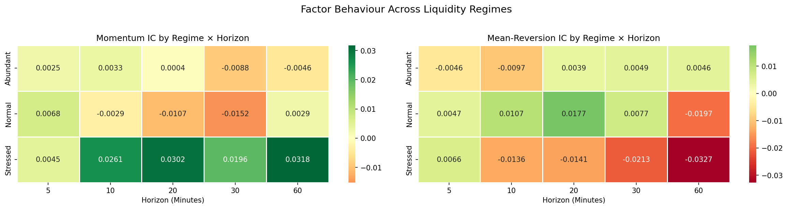

# Microstructure-Informed Factor Decay Analysis Across Endogenous Liquidity Regimes
### Regime-Dependent Signal Persistence in U.S. Equity Microstructure

**Author:** Kyle Chan | **Date:** May 2026

---

## Overview

This project investigates whether alpha signal decay is a static property of a signal or a function of the prevailing market microstructure regime. Using 44GB of Nasdaq TotalView-ITCH MBP-1 nanosecond tick data, I identify three latent liquidity regimes via a Gaussian Hidden Markov Model and measure how momentum and mean-reversion signal predictive power evolves across horizons within each regime.

**Core Finding:** In Stressed (illiquid) regimes, the 5-minute momentum signal does *not* decay — it builds, peaking at the 20-minute horizon (IC ≈ 0.030). In Abundant (liquid) regimes, both signals are arbitraged to near-zero within one bar. This "Delayed Price Discovery" effect implies that alpha decay is regime-dependent, with direct implications for execution algorithm design.

---

## Repository Structure

```
├── data/
│   ├── raw/                             # Raw Databento MBP-1 .dbn.zst files (not tracked)
│   ├── processed/                       # Daily 5-min CSV aggregates (not tracked)
│   ├── master_metrics.csv               # Combined feature dataset (not tracked)
│   └── master_metrics_with_regimes.csv  # Final dataset with HMM labels (not tracked)
├── figures/
│   ├── tsla_regimes.png                 # TSLA price path with regime shading
│   ├── msft_regimes.png                 # MSFT price path with regime shading
│   ├── bio_regimes.png                  # BIO price path with regime shading
│   ├── ic_decay_curves.png              # IC decay curves by regime
│   └── ic_heatmaps.png                  # Side-by-side momentum vs mean-reversion heatmaps
├── 01_data_pipeline.ipynb               # Data ingestion, Lee-Ready, feature engineering
├── 01_exploration.ipynb                 # Initial data exploration
├── 02_liquidity_regimes.ipynb           # HMM regime classification
├── 03_factor_decay.ipynb                # IC decay analysis, crossover table
├── liquidity_regimes.pdf                # Full research paper
└── README.md
```
---

## Methodology

### Data Pipeline
- **Source:** Databento Nasdaq TotalView-ITCH MBP-1 (nanosecond resolution)
- **Universe:** 10 U.S. equities spanning the liquidity spectrum (SPY, AAPL, MSFT, JPM, TSLA, BIO, IPGP, MTD, JKHY, ALLE)
- **Period:** August 1 – October 31, 2023
- **Trade Classification:** Lee-Ready algorithm with per-symbol tick rule (prevents cross-ticker signal bleeding)
- **Features:** Effective spread, Amihud illiquidity ratio, Kyle's Lambda (vectorized OLS)

### Regime Classification
- 3-state Gaussian HMM fitted on per-symbol z-scored features
- States labeled by raw Amihud mean: **Abundant** (52%), **Normal** (39%), **Stressed** (9%)
- Transition matrix confirms regime persistence: Abundant→Abundant = 0.91, Normal→Normal = 0.88

### Factor Decay Analysis
- **Signals:** 5-min momentum (lagged return) and mean-reversion (negative 3-bar rolling return)
- **IC:** Spearman rank correlation at horizons of 5, 10, 20, 30, 60 minutes
- **Significance:** Newey-West HAC standard errors on all horizons

---

## Key Results

| Regime | 5 min | 10 min | 20 min | 30 min | 60 min |
|--------|-------|--------|--------|--------|--------|
| Abundant | 0.0025 | 0.0033 | 0.0004 | -0.0088 | -0.0046 |
| Normal | 0.0068 | -0.0029 | -0.0107 | -0.0152 | 0.0029 |
| **Stressed** | **0.0045** | **0.0261** | **0.0302** | **0.0196** | **0.0318** |

*Momentum signal Spearman IC by regime and horizon*



---

## Tech Stack

| Category | Tools |
|----------|-------|
| Data | Databento MBP-1, Nasdaq TotalView-ITCH |
| Processing | Python, pandas, numpy |
| ML | hmmlearn (Gaussian HMM) |
| Statistics | statsmodels (Newey-West HAC), scipy (curve_fit) |
| Visualization | matplotlib, seaborn |

---

## Research Paper

The full write-up is available in [`liquidity_regimes.pdf`](liquidity_regimes.pdf), covering methodology, empirical results, and execution implications in detail.
